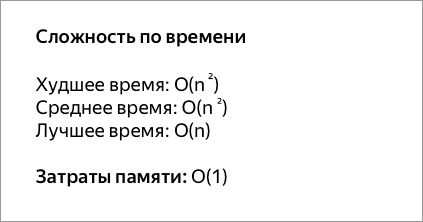

## Сортировка пузырьком

Сортировка пузырьком — один из самых известных алгоритмов сортировки. Здесь нужно последовательно сравнивать значения соседних элементов и менять числа местами, если предыдущее оказывается больше последующего. Таким образом элементы с большими значениями оказываются в конце списка, а с меньшими остаются в начале.
Этот алгоритм считается учебным и почти не применяется на практике из-за низкой эффективности:
