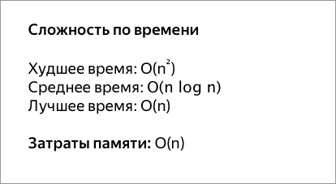

## Быстрая сортировка

Этот алгоритм состоит из трёх шагов. Сначала из массива нужно выбрать один элемент — его обычно называют опорным. Затем другие элементы в массиве перераспределяют так, чтобы элементы меньше опорного оказались до него, а большие или равные — после. А дальше рекурсивно применяют первые два шага к подмассивам справа и слева от опорного значения.

Быструю сортировку изобрели в 1960 году для машинного перевода: тогда словари хранились на магнитных лентах, а сортировка слов обрабатываемого текста позволяла получить переводы за один прогон ленты, без перемотки назад.
