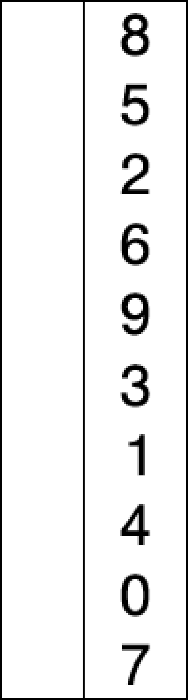
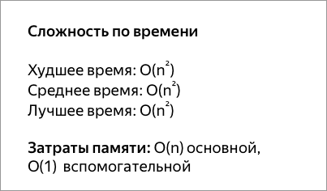

## Сортировка выбором

Сначала нужно рассмотреть подмножество массива и найти в нём максимум (или минимум). Затем выбранное значение меняют местами со значением первого неотсортированного элемента. Этот шаг нужно повторять до тех пор, пока в массиве не закончатся неотсортированные подмассивы.
